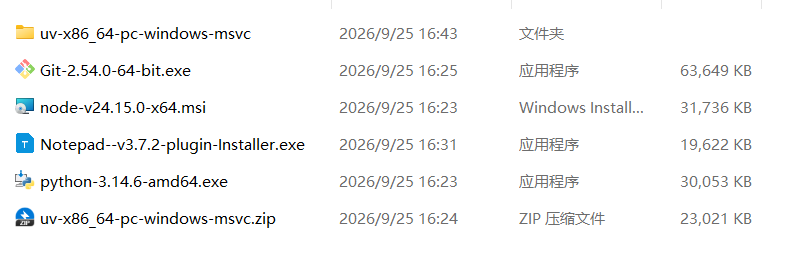
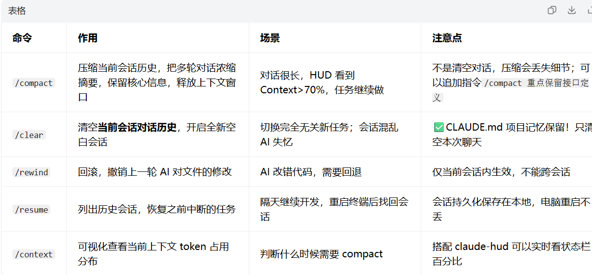
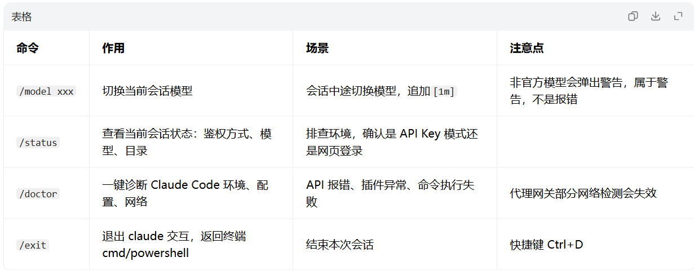
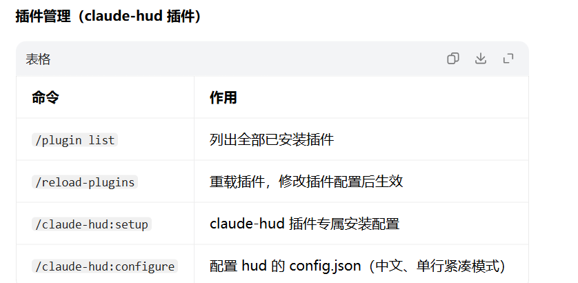

## Vibe Coding 定义：自然语言描述目标，AI Agent 自主读文件、改代码、跑命令、自测；人从**手写代码**变成**定义意图、验收结果、控制边界**。不是完全不用懂代码，而是把重心转移到需求拆解、上下文管理、风险把控。
工具：Claude Code（终端 CLI Agent）

### API Key 代理鉴权（）

不需要 `/login`！靠环境变量 /settings.json 注入密钥、反向代理地址。
需要 3 个核心环境变量：

```
"ANTHROPIC_API_KEY": "sk-xxx",
"ANTHROPIC_BASE_URL": "https://api.deepseek.com/anthropic",
"ANTHROPIC_MODEL": "deepseek-v4-pro[1m]"
```

sk-08a5d4cf50404142baeb00f27f90f8ba

- `ANTHROPIC_BASE_URL`：DeepSeek 提供兼容 Anthropic 协议网关，让 Claude Code 可以调用 DeepSeek 大模型
- `[1m]` 后缀：告诉 Claude Code，该模型支持 100 万上下文，消除`模型不在目录`警告
- 额外可选：`CLAUDE_CODE_DISABLE_UNKNOWN_MODEL_WINDOW_ENFORCEMENT:"1"` 直接关闭未知模型上下文限制

> 
> 鉴权成功标志：启动 claude，虽然提示`Not logged in`红色文字，**但可以正常发起 API 请求**（这个提示只是代表没有网页账号登录，API 代理模式属于正常现象）


前置环境准备（Vibe Coding 必备依赖）



## 项目初始化（Vibe Coding 第一步：新项目必做 `/init`）

### `/init`

- 作用：扫描当前目录全部源码、配置文件，自动生成 / 更新 `CLAUDE.md`
- `CLAUDE.md` = **项目级长期记忆**（跨会话保存，不会被`/clear`删除）
  - 记录项目架构、依赖、打包命令、代码规范、约束规则
  - 每次进入这个项目目录启动 claude，自动加载 CLAUDE.md，AI 自带项目背景，减少重复解释
- 使用场景：新项目第一次打开；大规模重构后刷新 AI 认知
- 注意点
  1. 大项目扫描耗时久，会读取大量文件、消耗 token
  2. 只生成项目记忆，**不会清空当前对话历史**
  3. `/memory`：直接打开编辑 CLAUDE.md，手动追加项目约束、编码规范


  ## 三大运行模式（Shift+Tab 切换，Vibe Coding 核心安全开关）

> 
> 在 claude 交互窗口，快捷键`Shift+Tab`循环切换，HUD 状态栏会实时显示当前模式

1. **Plan 模式（规划模式，最安全）**
   - 只读！**不能修改任何文件、不能执行 bash 命令**
   - AI 只做分析、输出方案、列出改动清单，等待你确认后再执行
   ✅适用：大型重构、高危操作、不熟悉代码库、不确定需求
2. **Manual mode（手动审批模式）**
   - AI 要修改文件 / 执行 shell 命令，**每一步都会弹窗等待你手动回车确认**
   ✅适用：学习阶段、陌生项目、有风险脚本
3. **Auto mode（自动模式，Vibe Coding 主力模式，你当前在用）**
   - AI 自带安全分类器：自动判断动作风险；安全操作自动执行，高危操作拦截
   ✅适用：日常开发、迭代、写单元测试、小功能开发
   ⚠️注意：你用 DeepSeek 代理时，会提示`auto-mode计费分类不兼容`，**不影响代码读写、bash 执行，直接忽略**

   
   命令	作用	场景	注意点
/compact	压缩当前会话历史，把多轮对话浓缩摘要，保留核心信息，释放上下文窗口	对话很长，HUD 看到 Context>70%，任务继续做	不是清空对话，压缩会丢失细节；可以追加指令/compact 重点保留接口定义
/clear	清空当前会话对话历史，开启全新空白会话	切换完全无关新任务；会话混乱 AI 失忆	✅CLAUDE.md 项目记忆保留！只清空本次聊天
/rewind	回滚，撤销上一轮 AI 对文件的修改	AI 改错代码，需要回退	仅当前会话内生效，不能跨会话
/resume	列出历史会话，恢复之前中断的任务	隔天继续开发，重启终端后找回会话	会话持久化保存在本地，电脑重启不丢
/context	可视化查看当前上下文 token 占用分布	判断什么时候需要 compact	搭配 claude-hud 可以实时看状态栏百分比


命令	作用	场景	注意点
/model xxx	切换当前会话模型	会话中途切换模型，追加[1m]	非官方模型会弹出警告，属于警告，不是报错
/status	查看当前会话状态：鉴权方式、模型、目录	排查环境，确认是 API Key 模式还是网页登录	
/doctor	一键诊断 Claude Code 环境、配置、网络	API 报错、插件异常、命令执行失败	代理网关部分网络检测会失效
/exit	退出 claude 交互，返回终端 cmd/powershell	结束本次会话	快捷键 Ctrl+D






### 辅助命令

- `/review`：代码审查，扫描 bug、优化点
- `/btw xxx`：临时提问，**不写入会话上下文，不占用 token**
- `/help`：查看全部可用命令（原生 + 插件）

## Vibe Coding 标准工作流（推荐开发流程）

```
1.新建项目文件夹 → cd进入目录
2.执行 /init → 自动扫描项目生成CLAUDE.md（项目记忆）
3.描述需求（写清楚目标、约束、验收标准、技术栈）
4.根据风险选择模式：
   - 大重构 → Plan模式先看方案
   - 日常开发 → Auto模式
   - 陌生高危代码 → Manual模式
5.持续迭代，当HUD上下文>70%，执行 /compact
6.功能完成，切换新任务 → /clear 清空会话
7.完成开发，/exit退出
```

### 高质量提示词模板（Vibe Coding 写需求的核心）

> 
> 需求目标 + 技术栈 + 约束条件 + 验收标准 + 涉及文件
> 示例：

```
目标：实现登录页面
技术栈：Vue3 + Element Plus
约束：不能修改现有api.ts，保持接口签名不变；适配移动端
验收标准：
1.账号密码为空点击登录提示错误
2.密码错误弹出toast提示
3.登录成功跳转到首页
涉及文件：src/views/login.vue、src/api/user.ts
```
重点：**一定要写约束 + 验收标准**，否则 AI 容易随意改动、架构漂移。

## Vibe Coding 优缺点 & 风险（避坑）

### ✅优点

1. 快速原型，不用手动写大量样板代码
2. Agent 自动读文件、跑测试、修复报错，专注需求意图
3. CLAUDE.md 项目记忆，减少重复解释项目背景

### ⚠️风险（Vibe Coding 最容易踩坑）

1. **架构漂移**：多次迭代后代码结构慢慢乱掉，产生大量技术债。解决：重要项目定期进入 Plan 模式做架构评审，复杂项目后期切换 SDD 规范驱动开发。
2. **上下文溢出**：对话越长，模型越容易遗忘细节。解决：定期`/compact`，HUD 监控上下文占用。
3. **自动执行高危命令**（rm、删除文件、格式化）。解决：高危操作切 Plan 模式。
4. AI 幻觉：编造不存在接口、文件。解决：每次迭代后**运行测试验证，不要只看文字描述**。

## 常见报错 & 排查

1. `"xxx" isn't described by this version's model catalog`
   - 含义：模型不在官方内置列表，**警告，不是错误**。解决：模型名追加`[1m]`，或者配置`CLAUDE_CODE_DISABLE_UNKNOWN_MODEL_WINDOW_ENFORCEMENT=1`
2. `402 Insufficient Balance`：DeepSeek 余额不足，充值
3. `Not logged in`红色文字：API 代理模式正常提示，**无需 /login**
4. Bash 命令执行报错（Windows）：Windows 原生 CMD 不支持 bash 语法，部分 find/ls 命令会失败，改用 PowerShell，或者让 AI 改用 Windows 原生命令。
5. 插件 HUD 不显示：检查 settings.json 里面 statusLine 配置，执行`/reload-plugins`重载插件。


## 进阶：Vibe Coding → SDD 规范驱动（生产项目）

- Vibe Coding：适合原型、探索、快速验证想法（快，但是容易技术债）
- SDD（Spec Driven Development，规范驱动）：生产项目，**先写规范文档，定义接口、测试用例、约束，再让 AI 实现**。
最佳组合：**原型阶段 Vibe Coding 快速探索；交付上线阶段切换 SDD 规范约束**。

# 极简速查表

1. 新项目第一步：`/init`
2. 上下文快满：`/compact`
3. 换全新任务：`/clear`
4. 高危重构：Shift+Tab 切 Plan 模式
5. 查看状态：`/status`
6. 环境异常排查：`/doctor`
7. 切换模型：`/model deepseek-v4-pro[1m]`
8. 不要执行 `/login`（你代理环境）


## 一、项目初始化 & 项目记忆（你最常用）

### `/init`

- **作用**：扫描当前目录源码、文件，自动生成 / 更新`CLAUDE.md`项目记忆文档
- **使用场景**：新项目第一次进入 claude；项目大规模重构后，刷新 AI 对项目的认知
- **注意点**
  1. 只生成**项目级记忆**，不会清空当前对话历史
  2. 每个项目目录执行一次即可，不用反复执行
  3. 会读取大量文件，目录大的时候耗时较长
  4. 你这种代理 API（deepseek 网关）环境**完全可以正常运行**

### `/memory`

- **作用**：直接打开 / 编辑`CLAUDE.md`，手动写入项目规则、编码规范、约束
- **使用场景**：手动追加项目约定，例如 “本项目使用 2 空格缩进”、“禁止使用某个库”
- **注意点**：写入的内容永久保存在项目文件夹，每次打开 claude 自动加载

## 二、上下文 / 会话管理（高频，控制 token 消耗）

### `/compact`

- **作用**：**压缩当前对话历史**，把前面多轮对话总结成摘要，释放上下文窗口，保留核心信息
- **使用场景**：长任务，对话轮次很多，HUD 看到 Context 占用超过 70% 时执行；不想中断当前任务
- **注意点**
  1. 不是清空对话，是**摘要压缩**，任务可以继续往下做
  2. 可以附加指令：`/compact 重点保留接口定义和报错信息`
  3. 会话很短时执行会提示：没有足够内容可压缩

### `/clear`（别名 `/reset` `/new`）

- **作用**：清空**当前会话全部对话历史**，会话重置空白
- **使用场景**：切换全新任务；上下文占满、AI 开始遗忘前面内容；会话混乱想重来
- **注意点**
✅ **CLAUDE.md 项目记忆保留！** 只是清空本次聊天记录
✅ 旧会话不会删除，可以`/resume`找回
❗和`/compact`区别：
  - `/compact`：**继续当前任务，压缩历史**
  - `/clear`：**结束当前对话，全新会话**

### `/rewind`

- **作用**：回滚对话、代码修改，退回到上一个检查点
- **使用场景**：AI 改错代码，想撤销上一轮的文件修改
- **注意点**：只能回退当前会话内的变更，不能跨会话

## 三、模型、账号、计费相关（你用 API 代理重点看）

### `/model`

- **作用**：查看 / 切换当前会话模型
- **示例**：`/model deepseek-v4-pro[1m]`
- **使用场景**：会话中途切换模型；给未知模型追加上下文标记`[1m]`
- **注意点**
  1. 你当前用 deepseek 代理，官方模型列表不识别 deepseek，会报模型目录警告（**警告，不影响调用**）
  2. 加`[1m]`告诉 Claude Code 该模型支持 1M 上下文

### `/login`

- **作用**：网页账号登录（Anthropic 官方订阅账号）
- **使用场景**：用 claude.ai 订阅账号登录
- **⚠️重点注意**：**你现在是 API Key 模式（ANTHROPIC_API_KEY 环境变量），不需要执行 /login！** 执行 /login 会切换成网页账号模式，会覆盖你的 API 代理配置

### `/logout`

- **作用**：退出网页登录账号
- **注意点**：API Key 模式不受这个命令影响

### `/cost`

- **作用**：查看当前会话 token 消耗、本次会话费用
- **使用场景**：想查看本次对话花了多少 token（你 DeepSeek 余额查询看这个）
- **注意点**：代理网关（deepseek）的计费统计会有一定限制

### `/status`

- **作用**：查看当前会话状态：模型、目录、鉴权方式、版本
- **使用场景**：排查环境，确认当前是 API key 鉴权还是网页账号登录

## 四、插件、状态栏配置（claude-hud 相关）

### `/plugin`

- **作用**：插件管理，安装 / 卸载 / 启用 / 禁用插件
- **示例**：`/plugin list` 列出所有插件
- **使用场景**：安装 claude-hud、MCP 插件
- **注意点**：安装插件后部分插件需要`/reload-plugins`重载

### `/statusline`

- **作用**：配置底部状态栏（claude-hud 就是 statusLine 插件）
- **使用场景**：修改、删除、自定义状态栏显示
- **注意点**：claude-hud 插件本质就是 statusLine 自定义命令

### `/claude-hud:setup` / `/claude-hud:configure`（claude-hud 插件专属命令，非原生）

- 安装 hud 插件、配置 hud 的`config.json`，开启中文、单行紧凑模式

## 五、诊断、排错命令

### `/doctor`

- **作用**：一键诊断 Claude Code 环境、配置、权限、网络问题
- **使用场景**：API 报错、插件异常、命令执行异常时排查
- **注意点**：对你的代理 API 网关，部分网络检测会失效，但基础配置检查可用

### `/help`

- **作用**：列出当前所有可用命令（原生 + 插件命令）
- 使用场景：忘记命令，直接输入`/help`查看

## 六、会话与工具模式

### `/plan`

- **作用**：进入 Plan 模式，AI 只输出方案，**不直接修改文件 / 执行命令**，等待你确认后再执行
- **场景**：高危重构、大规模代码修改，先看方案再决定是否执行
- **注意点**：Plan 模式不会自动执行任何修改，需要你确认

### `/exit`

- **作用**：退出 claude 交互会话，回到终端 CMD/PowerShell
- 快捷键：`Ctrl+D`

> 
> 权限模式快捷键（不用斜杠命令）：`Shift+Tab` 在会话内循环切换：auto /manual/plan /acceptEdits（就是你 HUD 上显示的 auto mode）

## 七、辅助小命令

- `/context`：可视化查看当前上下文 token 占用分布
- `/review`：代码审查，自动扫描代码 bug、优化点
- `/btw xxx`：临时提问，**不写入会话上下文**，用完即丢，不占用 token

# ✅ 最佳工作流（推荐你日常使用）

1. 新项目：`/init` → 生成 CLAUDE.md
2. 编码迭代，HUD 看到 Context>70% → 执行`/compact`
3. 任务完成，开启全新任务 → 执行`/clear`
4. 模型切换：`/model deepseek-v4-pro[1m]`
5. 环境异常、插件报错：`/doctor`